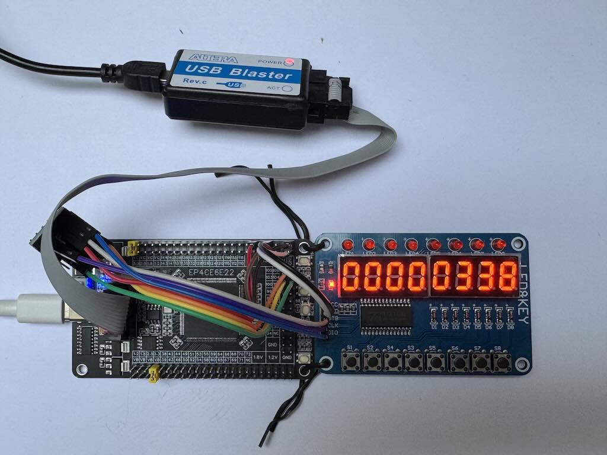
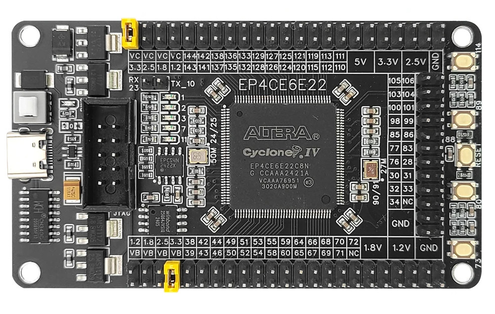
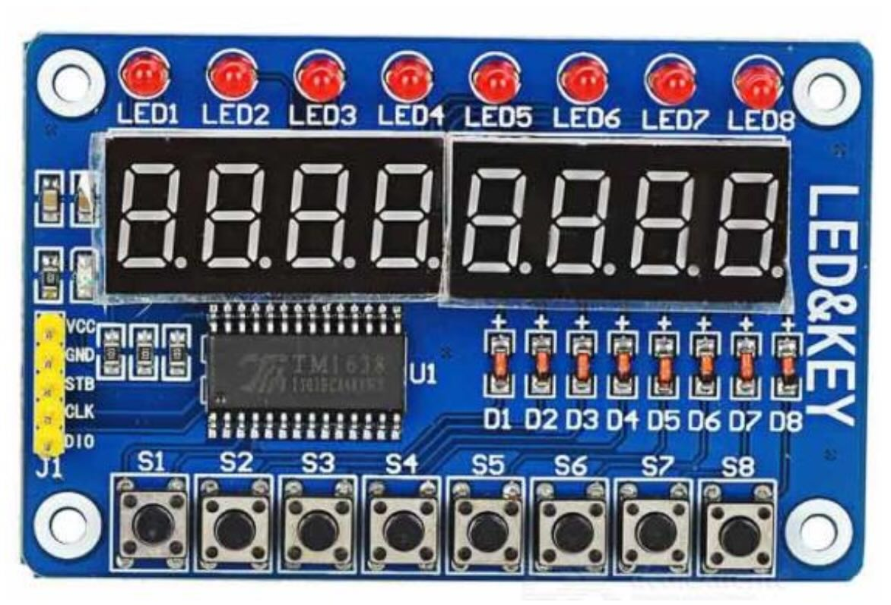
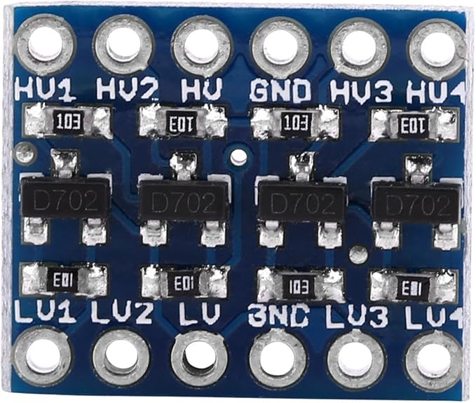

# FPGA TM1638 Controller

A Verilog-based driver and controller for the TM1638 LED & Key module, designed for FPGA implementation (tested on Altera/Intel EP4CE6E22 Cyclone IV FPGA).

## 📋 Overview

The TM1638 is a popular and inexpensive 8-digit 7-segment LED display module with 8 LEDs and 8 push buttons. This project provides a complete FPGA controller implementation that allows you to easily interface with TM1638 modules in your FPGA projects.

  

## 📱 Screenshots

<div align="center">
   <br/>
  
</div>

## ✨ Features

- **Complete TM1638 Protocol Implementation**: Handles all communication protocols with the TM1638 chip
- **8-Digit 7-Segment Display**: Full control over all 8 digits with individual segment control
- **8 Programmable LEDs**: Control 8 individual LEDs on the module
- **8-Key Scanning**: Read status of all 8 push buttons simultaneously
- **Decimal Counter Example**: Included working example with decimal counting (0-9 per digit)

## 📦 Hardware Requirements

### FPGA Board
<div align="center">
  
</div>

- Altera/Intel Cyclone IV EP4CE6E22 FPGA (or compatible)
- 50MHz clock source
- 3.3V GPIO pins

### TM1638 Module
<div align="center">
  
</div>
- Standard TM1638 LED & Key module (commonly available on AliExpress, eBay, etc.)
- Operating voltage: 3.3V or 5V

### Level shifters
<div align="center">
  
</div>
3.3V-5V 4 Channels Logic Level Converter Bi-Directional Shifter Module

### Connections
| TM1638 Pin | FPGA Pin | Description              |
|------------|----------|--------------------------|
| CLK        | GPIO     | Clock signal             |
| DIO        | GPIO     | Data I/O (bidirectional) |
| STB        | GPIO     | Chip select              |
| VCC        | 3.3V/5V  | Power (check module)     |
| GND        | GND      | Ground                   |

## 🚀 Quick Start

### 1. Clone the Repository
```bash
git clone https://github.com/karkadi/TM1638-FPGA.git
cd TM1638-FPGA
```

### 2. Project Structure
```
TM1638-FPGA/
├── sources/
│   ├── tm1638_controller.v     # Main TM1638 controller module
│   ├── u_tm1638.v              # Top-level module with decimal counter example
│   ├── tm1638_drv.v            # Low-level driver
│   ├── TM1638_FPGA.qpf         # Quartus project file
│   ├── TM1638_FPGA.qsf         # Quartus settings file
│   └── TM1638_BLOCK.bdf        # Quartus design file
└── README.md
```

### 3. Compile with Quartus
1. Open Quartus Prime
2. Open `sources/TM1638_FPGA.qpf`
3. Select your FPGA device (EP4CE6E22C8)
4. Compile the design

### 4. Program Your FPGA
1. Connect your FPGA board via USB-Blaster
2. Program the device with the generated `.sof` file
3. Connect TM1638 module to designated GPIO pins

## 🎮 Usage Examples

### Basic Instantiation
```verilog
module your_design(
    input wire CLK_50MHZ,
    input wire RST_N,
    output wire TM1638_STB,
    output wire TM1638_CLK,
    inout wire TM1638_DIO
);

wire [7:0] keys;
reg [3:0] display_digits [0:7];
reg [7:0] leds;

// Instantiate TM1638 controller
tm1638_controller tm1638_ctrl (
    .CLK_IN(CLK_50MHZ),
    .RST_IN(RST_N),
    .DIGIT_0(display_digits[0]),
    .DIGIT_1(display_digits[1]),
    .DIGIT_2(display_digits[2]),
    .DIGIT_3(display_digits[3]),
    .DIGIT_4(display_digits[4]),
    .DIGIT_5(display_digits[5]),
    .DIGIT_6(display_digits[6]),
    .DIGIT_7(display_digits[7]),
    .DOTS(8'b00000000),  // Control decimal points
    .LEDS(leds),         // Control 8 LEDs
    .KEYS(keys),         // Read 8 buttons
    .TM1638_STB(TM1638_STB),
    .TM1638_CLK(TM1638_CLK),
    .TM1638_DIO(TM1638_DIO)
);

// Your application logic here
// Update display_digits and leds based on keys input

endmodule
```

### Creating a Decimal Counter
The included example (`u_tm1638.v`) implements an 8-digit decimal counter that increments every 100ms. Each digit counts independently 0-9 with proper carry to the next digit.

## 🔧 Configuration

### Display Brightness
Adjust the brightness by modifying the display control command in `tm1638_controller.v`:
```verilog
// Brightness levels: 000 (1/16) to 111 (14/16)
localparam DISP_CTRL = 8'b10000111;  // Display ON, brightness 7/16
```

### Scanning Speed
Modify the timing in the top module:
```verilog
// Adjust for different update rates
localparam TIMER_MAX = 5000000 - 1;  // 100ms at 50MHz
```

## 📊 Resource Usage (EP4CE6E22)

| Resource        | Used | Available | Utilization |
|-----------------|------|-----------|-------------|
| Logic Elements  | ~396 | 6,272     | 6%          |
| Registers       | ~180 | 6,272     | 3%          |
| Memory bits     | 0    | 276,480   | 0%          |
| Pins            | 5    | 92        | 5%          |

## 📚 API Reference

### tm1638_controller Module

#### Ports
- `CLK_IN`: System clock (50MHz typical)
- `RST_IN`: Active-low reset
- `DIGIT_0` to `DIGIT_7`: 4-bit digit values (0-15 for hex, 0-9 for decimal)
- `DOTS`: 8-bit decimal point control (1=on)
- `LEDS`: 8-bit LED control (1=on)
- `KEYS`: 8-bit button status (1=pressed)
- `TM1638_STB`: Chip select (active low)
- `TM1638_CLK`: Serial clock
- `TM1638_DIO`: Bidirectional data line

#### Display Format
The controller expects 4-bit values for each digit:
- Values 0-9: Display decimal digits 0-9
- Values 10-15: Display hexadecimal A-F
- Use external 7-segment decoder for custom patterns

## 📄 License

This project is licensed under the MIT License.
See [LICENSE](LICENSE) for details.

## 🙏 Acknowledgments

- TM1638 datasheet and protocol reference
- Altera/Intel for Quartus Prime tools
- Open source FPGA community
